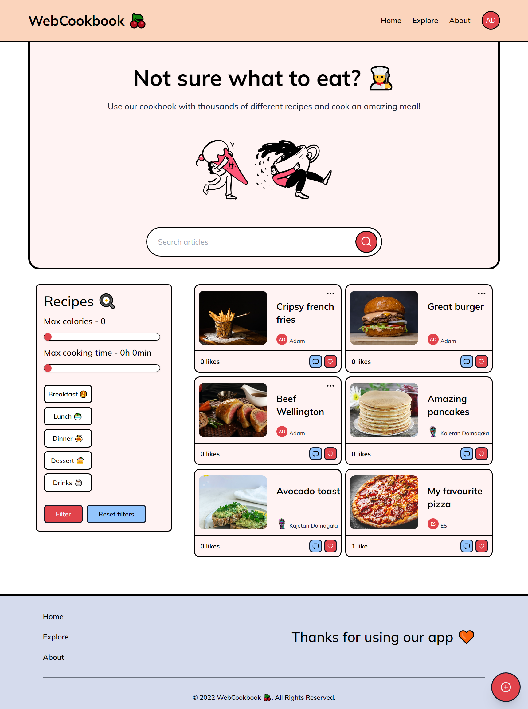

<div id="top"></div>

<!-- PROJECT HEADER -->
<br />
<div align="center">
  <a href="https://github.com/kajtd/WebCookbook">
    🍒
  </a>

  <h3 align="center">WebCookbook</h3>
  <p align="center">
    Social media app for people who love to cook.
  </p>
</div>

<!-- TABLE OF CONTENTS -->
<details>
  <summary>Table of Contents</summary>
  <ul>
    <li><a href="#about-the-project">About The Project</a></li>
    <li><a href="#technologies">Technologies</a></li>
    <li><a href="#getting-started">Getting Started</a></li>
    <li><a href="#usage">Usage</a></li>
    <li><a href="#contributing">Contributing</a></li>
    <li><a href="#license">License</a></li>
    <li><a href="#acknowledgments">Acknowledgments</a></li>
  </ul>
</details>

<!-- ABOUT THE PROJECT -->

## About The Project



Want to learn to cook but don't know where to begin? Make use of our cookbook for a variety of food recipes! Find the food that best suits you and share your culinary adventure with us!

<!-- TECHNOLOGIES -->

## Technologies

```js
- Vue: 3.2.25
- Typescript: 4.5.4
- Vite: 2.9.9
- TailwindCSS: 3.1.2
- Firebase: 9.8.3
```

<p align="right">(<a href="#top">back to top</a>)</p>
<!-- GETTING STARTED -->

## Getting Started

Here is how you can set up this project by yourself.
To get a local copy up and running follow these simple example steps.

### Installation - client

1.  Go to the [Firebase](https://console.firebase.google.com).
2.  Create a new project.
3.  Add Firebase to your web app.
4.  Follow instructions and install firebase.
5.  Enter your Firebase configuration in `.env` file.
    ```sh
    VITE_FIREBASE_API_KEY=''
    VITE_AUTH_DOMAIN=''
    VITE_PROJECT_ID=''
    VITE_STORAGE_BUCKET=''
    VITE_MESSAGING_SENDER_ID=''
    VITE_APP_ID=''
    ```
6.  Enable firestore database and create two collections: Recipes and Comments.
7.  Install NPM packages and run the app.
    ```sh
    npm install
    npm run dev
    ```

<!-- USAGE -->

## Usage

Below you can read the instructions on how to use this social media app.

<ol>
    <li>Login to the app or create a new account</li>
    <li>Browse already existed recipes</li>
    <li>Create a new recipe and share it with others</li>
</ol>

If you like any recipe, like it or let the author know that by sharing a comment.

<p align="right">(<a href="#top">back to top</a>)</p>

<!-- CONTRIBUTING -->

## Contributing

Any contributions you make are **greatly appreciated**.

If you have a suggestion that would make this better, please fork the repo and create a pull request. You can also simply open an issue.

1. Fork the Project
2. Create your Feature Branch (`git checkout -b feature/AmazingFeature`)
3. Commit your Changes (`git commit -m 'Add some AmazingFeature'`)
4. Push to the Branch (`git push origin feature/AmazingFeature`)
5. Open a Pull Request

<p align="right">(<a href="#top">back to top</a>)</p>

<!-- LICENSE -->

## License

Distributed under the MIT License. See `LICENSE.txt` for more information.

<p align="right">(<a href="#top">back to top</a>)</p>

## Acknowledgments

- [Best-README-Template](https://github.com/othneildrew/Best-README-Template)

<p align="right">(<a href="#top">back to top</a>)</p>
